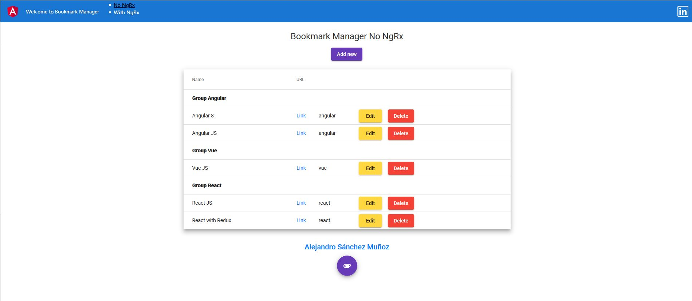
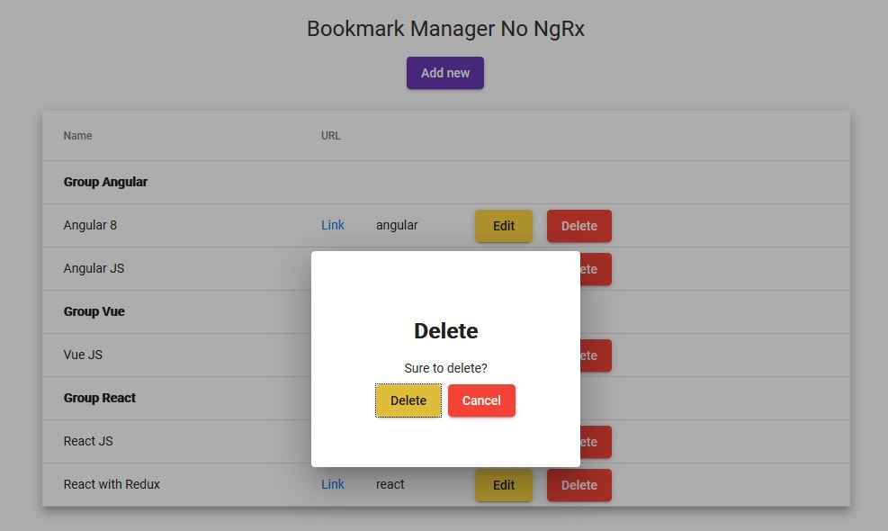
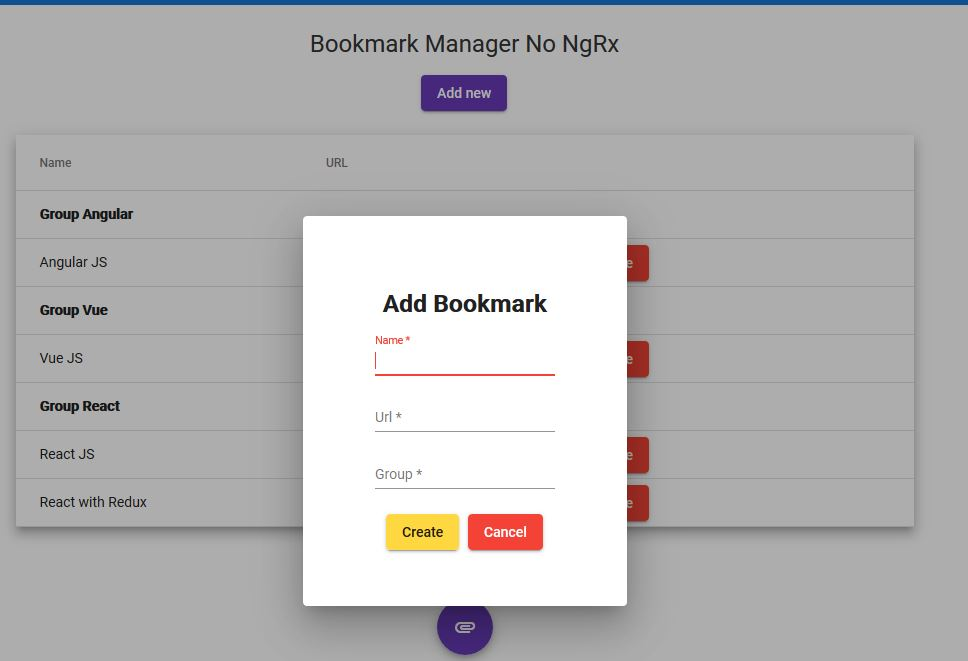

# Alejandro Sanchez

[Alejandro Sánchez Muñoz CV](https://www.linkedin.com/in/alejandrosanchez92/)

# Goal

Create a table using the component Angular Material Table. The table will manage bookmarks.
These are main properties of each bookmark: name, url, group (work / leisure/ personal / ...)
Use the user interface for displaying the bookmarks groupped by the "group" property.

# Description

The app is a simple table which shows a bookmark management panel. In this manager you can add new bookmarks, edit them or delete what you want.

Data is displayed grouped by 'group' category to ease its visualization. When a bookmark group is modified, the table reallocate the row into its new group. If the group does not exist, it creates a new group and agrupation. If a group runs out of items, that group disappears.

## Routes
There are two different routes depending the injection of the data into the table. The first one works only with Material Table and data loaded in the main component shared with table. While, the second uses the state with NgRx and application store-state.

Route navigation is on top nav bar:
* no-ngrx
* ngrx

All actions (add, edit, delete, grouping) are implemented in both routes.

## no-ngrx Route
It works only with Angular Material Table with separated Form and Table components. It does not use NgRx and store properties.

## ngrx Route

It works with NgRx, localStorage and Angular Material Table. Data is saved in localStorage also. So if you refresh the page with F5 previous modifications are manteined. To reset, try deleting localStorage by browser console or closing the browser.

# Screenshots

# How to run

Project generated with [Angular CLI](https://github.com/angular/angular-cli) version 9.1.8.

## Development server

First of all, install npm dependencies and modules not includes in the repository.
Run `npm install`

To test the solution, just run `ng serve` for a dev server. Navigate to `http://localhost:4200/`. The app will automatically reload if you change any of the source files.

## Build

Run `ng build` to build the project. The build artifacts will be stored in the `dist/` directory. Use the `--prod` flag for a production build.